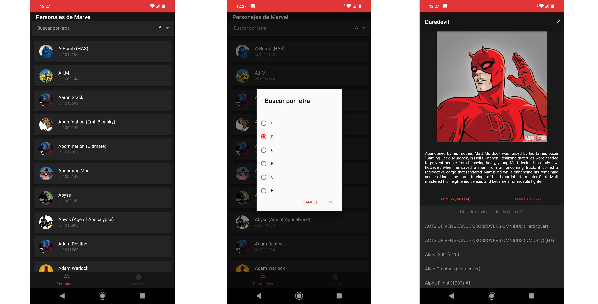

# Personajes de Marvel
## Código de aplicación hecha para ganar una entrada a [TalentLand][df1] con [Softek][df7]

### En esta app tú puedes:
* Listar 20 personajes de Marvel por letra.
* Ver los detalles de cada personaje mostrado, incluyendo: su imagen, su descripción (si es que la tiene), la lista de comics en los que aparece y la lista de series en la que aparece.



## Puedes descargar el apk [aquí][df2], ver el [demo web][df6] o   puedes correr el proyecto así:

**Se requiere tener instalado [NodeJS][df3], [Android SDK][df4] y [Ionic][df5]**

```sh
git clone https://github.com/carlosgasa/Personajes-de-Marvel.git
git checkout master
cd Personajes-de-Marvel
npm install
```

Para ver en el explorador:
```sh
ionic serve
```
Para correr en el teléfono (con usb debug):
```sh
ionic cordova run android
```


[df1]: <https://www.talent-land.mx/>
[df2]: <https://github.com/carlosgasa/Personajes-de-Marvel/raw/gh-pages/marvel_app_prod_1.0.0.apk>
[df3]:<https://nodejs.org/es/>
[df4]:<https://developer.android.com/studio>
[df5]:<https://ionicframework.com/>
[df6]:<https://carlosgasa.github.io/Personajes-de-Marvel/>
[df7]:<https://www.facebook.com/softtek/>
